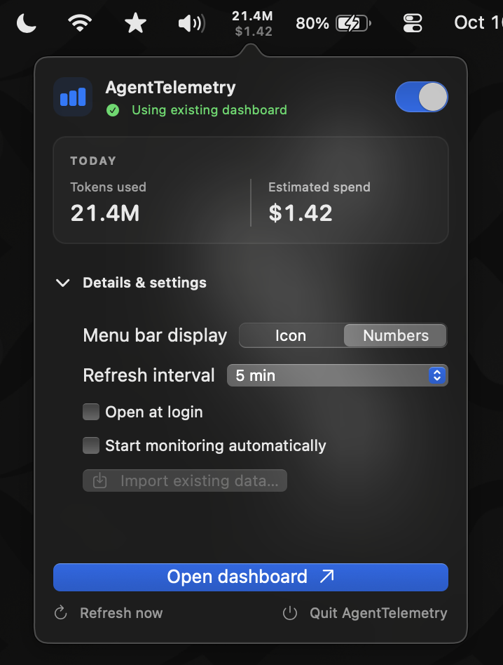
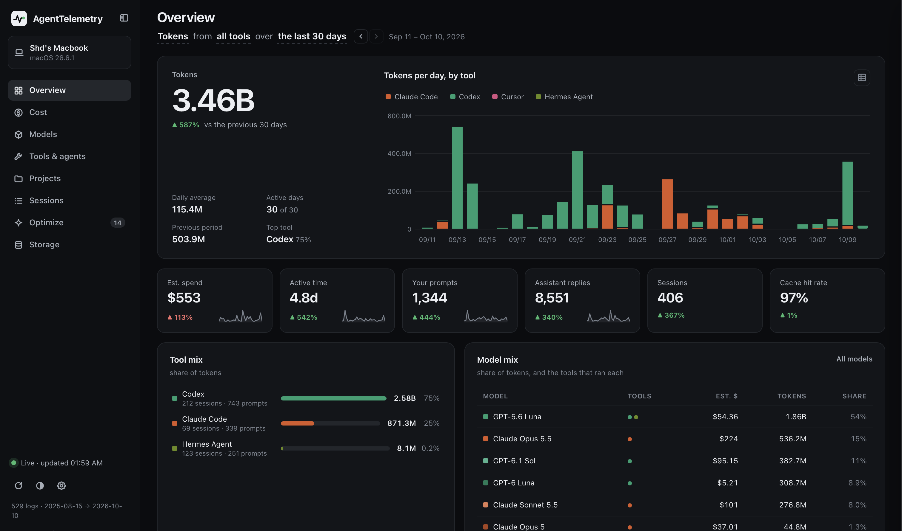

# AgentTelemetry

**Live, local telemetry for your AI coding agents.** AgentTelemetry reads the interaction
logs your tools already write to your own machine and serves a clean, interactive
dashboard — estimated spend, tokens, active time, cache efficiency, an **Anthropic vs OpenAI
vs Google** provider comparison, an activity calendar, and breakdowns by **model, provider,
day, hour, weekday, tool, IDE, project and session** — plus how much **disk** all these logs
eat, and suggestions for spending less, drawn from your own numbers.

**Your data never leaves your machine** — unless you turn on [Your devices](#your-devices-optional)
to combine two of your own computers over your local network. No account, no API key, no
telemetry, no dependencies — just Python's standard library and a vendored copy of Chart.js.

Covers **Claude Code · Claude Desktop · Codex · GitHub Copilot · Cursor · opencode · Hermes Agent · OpenClaw**.

---

## Preview

<table>
  <tr>
    <th>Menu bar companion</th>
    <th>Usage dashboard</th>
  </tr>
  <tr>
    <td></td>
    <td></td>
  </tr>
</table>

## Quick start

```bash
git clone https://github.com/uttamdeb/agent-telemetry.git
cd agent-telemetry
python3 dashboard.py
```

Then open **http://127.0.0.1:7878**. That's it — no `pip install`, no setup.

> First run parses your local logs (can take ~30–60s if you have large Codex logs), writes
> a cache, and is instant thereafter. The page auto-refreshes every ~15s, so a session
> you're running *right now* shows up within seconds.

Options: `python3 dashboard.py --port 9000` · `--rebuild` (ignore cache, full re-parse) ·
`--interval 20` (background refresh seconds) · `--data-dir /path/to/state` (store the
cache and optional device-sharing files outside the checkout). Without `--data-dir`, current
checkout behavior is unchanged. Or `./run.sh [flags]`.

## Install the menu bar / system tray app

From your checkout, run **`python3 install.py` on macOS** or **`python install.py` on Windows**.
The installer detects the OS, installs its matching native client for the current user and
opens it. Use `--no-launch` to install without opening. Linux keeps the browser dashboard.

| Platform | Native client | Installation requirements |
| --- | --- | --- |
| macOS 13+ | SwiftUI/AppKit menu item, token/spend popover and embedded dashboard | Python to run the installer; Swift 5.8+ and a macOS SDK to build the app. The app then uses its bundled Python. |
| Windows 10/11 | Native notification-area icon/menu, token/spend totals and dashboard in your browser | Standard Python 3.8+ including `pythonw.exe`. No pip packages or separate GUI toolkit. |

After installation, **web Settings → Menu bar / system tray** has a toggle to launch or
quit the native app. Status reflects the app's heartbeat, not just a launch attempt. You
can also open **AgentTelemetry.app** in `~/Applications` or **AgentTelemetry** from the
Windows Start menu. The app's **Open at Login** and **Start monitoring when app opens**
options are separate and off by default. Opening from the installer or web toggle starts
monitoring for that launch. No dashboard setting is required to open an app manually.

Both clients reuse a dashboard already running on port 7878 and stop only a backend they
started. A web/native app using a custom dashboard port is not supported by the native
clients. Failure shows stale figures explicitly, and retries can recover. Import existing
data before first app-owned monitoring if you need archived history: importing validates
and copies the ledger without overwriting existing app data or changing the originals.
For that flow, install with `--no-launch`, open the app manually and choose Import before
Start monitoring. A default install attaches safely when the old dashboard is still running.

Browser windows, the macOS menu bar and the Windows tray share one refresh interval:
15 seconds (default), 1/5/15 minutes, or Manual. Change it in web Settings or the native
app while monitoring. They sample a small shared clock each second and show figures
from the same snapshot; a manual refresh in either app updates the others too, normally
within a second plus request time. Manual continues listening for those explicit refreshes.
The native figures are today's usage across all tools and connected devices; compare
them with an unfiltered Today dashboard. Pause pauses only that browser's figures.
Changing the interval does not restart the backend or reload the embedded dashboard.
The server's `--interval` controls log parsing separately. Older attached backends without
the sync API retain independent polling until upgraded and restarted.

Read the [macOS guide](macos/AgentTelemetryMac/README.md) and
[Windows guide](windows/README.md) for paths, controls and development checks. macOS
source builds are ad-hoc signed local builds; a prebuilt Developer ID signed/notarized
installer is not supplied. The backend remains stdlib-only and no runtime update checks
are added. The macOS packaging step downloads a hash-pinned Python runtime explicitly.

Local app integrations can use `GET /api/health` for a small readiness response that contains
no usage data, and `GET /api/summary` for today's token total and API-equivalent estimated
spend. Both are read-only; they follow the dashboard's existing host and origin rules.
`GET /api/sync` supplies the shared display clock; `POST /api/sync` sets its validated
interval through the same JSON/same-origin CSRF guard. The data and summary HTTP endpoints
retain one serialized snapshot per display tick, in memory only; the ledger is unaffected.
`GET /api/native` reports local app status. `POST /api/native` requires the same CSRF guard
as all writes. `POST /api/shutdown` additionally requires the owning Windows client's
per-process control token; a normal standalone dashboard cannot be stopped by that route.

> `--rebuild` deletes the cache, and with it every session whose log has since been deleted
> from disk (see [Storage](#storage--what-these-logs-cost-you-in-disk)). Copy
> `.usage_cache.json` somewhere safe first if you've cleaned up old logs.

**Requirements:** Python 3.8+ on **macOS, Linux or Windows**. On Windows run
`python dashboard.py` (or `run.cmd`); on macOS/Linux `python3 dashboard.py` (or `./run.sh`).

It works on anyone's machine because **nothing is hardcoded** — every location is derived at
runtime from your own `$HOME` / `%APPDATA%` / `%LOCALAPPDATA%` / `$XDG_*`, the numbers are
read live from your own logs on every refresh, and the disk figures come from your own drive.
Two people running this see two completely different dashboards.

---

## Everyone sees *their own* usage

This is the important part if you're sharing it: the dashboard has **no bundled data**.
On each machine it scans that user's own logs (`~/.claude`, `~/.codex`,
`~/Library/Application Support/…`, `~/.local/share/opencode`, `~/.hermes`, …) and builds a **fresh**
`.usage_cache.json` locally. That cache is **gitignored and never committed**, so a clone
starts empty and shows only the cloning user's numbers. (If you ever *copy the folder*
instead of cloning, delete `.usage_cache.json` first — that file is your personal data.)

---

## Data sources

| Tool | Where it reads | Tokens |
|---|---|---|
| **Claude Code** | `~/.claude/projects/**/*.jsonl` | exact (in/out/cache read+write, 5m/1h tiers) |
| **Claude Desktop** (agent mode) | `Claude/local-agent-mode-sessions/**` under App Support / `%APPDATA%` / `~/.config` | exact |
| **Codex** | `~/.codex/sessions/**`, `~/.codex/archived_sessions/**` | exact (in/cached/out/reasoning); subagents are identified and labelled |
| **GitHub Copilot** | VS Code / Insiders / Cursor `workspaceStorage/*/chatSessions/*.{json,jsonl}` | exact where Copilot recorded them (`promptTokens`/`completionTokens` on finished requests in current builds); estimated from message text for older chats · premium-request multiplier read separately |
| **Cursor** (native AI) | `Cursor/User/globalStorage/state.vscdb` under App Support / `%APPDATA%` / `~/.config` | partial — model, mode, timestamps, tool calls and AI-line stats are exact; tokens are on only ~2% of messages |
| **opencode** | `~/.local/share/opencode/opencode.db`, `%LOCALAPPDATA%\opencode\opencode.db`, `~/.opencode/opencode.db` (or `$OPENCODE_DATA_DIR`) | exact (in/out/reasoning/cache); cost is read from opencode's own per-message value |
| **Hermes Agent** | `~/.hermes/state.db` (or `$HERMES_HOME`, `%LOCALAPPDATA%\hermes`) | exact (in/out/cache/reasoning, per model) |
| **OpenClaw** | `~/.openclaw/agents/<agent>/agent/openclaw-agent.sqlite` (or `$OPENCLAW_STATE_DIR`; also the older `~/.clawdbot`, `~/.moltbot`) and the older per-session `sessions/*.jsonl` | exact (in/out/cache read/cache write/reasoning, per response); its own logged cost is used only for a model with no verified price. Large events are stored zstd-compressed: read with the `zstd` command or Python 3.14+ |

A tool you don't use simply contributes nothing. **Attribution is by tool, not by model** —
a Claude or GPT model used *inside* Copilot/Cursor/opencode/Hermes/OpenClaw counts under that tool, and the
Models table lists each `model × tool` row separately.

---

## What you get

Eight views in a left-hand sidebar, light + dark theme, everything date-filterable, and the
**name of this machine** at the top — so a screenshot always says which computer it came from.

The controls read as a sentence above every view — "**Tokens** from **all tools** over
**the last 30 days** ‹ ›" — click a bold phrase to change it; the arrows step back and
forward a period at a time. Inside them: the **measure** (**Tokens · Cost · Messages · Time**
— tokens by default; every chart and ranking switches together), the **period** (today, the
last 7–365 days, this week / month / quarter / year, last month, all time, or a custom
range), and a single **Filters** panel (tool, provider, model, project, IDE / surface, and *exact tokens only*).
Active filters show as removable chips. Every figure is compared with the equal-length
period just before it, and every chart has a **table view** (the grid icon) so nothing is
readable only by hovering.

**Overview** — one hero number (the chosen measure, tokens by default) with its change vs
the previous period · per-day chart stacked by tool · tiles for the rest — spend, tokens,
active time, prompts, replies, sessions and cache hit rate — each with a sparkline · **tool, model and project mix** (each one's share of the chosen measure) · highlights ·
**hour × weekday heatmap** · token mix per tool · 12-month activity calendar (click a day).
With another device connected, **By device** compares each computer's share of the
selected measure (tokens, messages, estimated cost or active time), with a table view.
It follows the same date and usage filters as the rest of Overview.

**Cost** — total with per-active-day, 30-day run rate, per session and per prompt ·
cumulative spend by tool against the previous period · **cache hit rate and what caching
saved you** · spend by model, by project and by **token type** (what cache reads vs writes vs
output actually cost you) · effective rate by model, as *all tokens* or *per output* (the one
that's comparable across providers) · daily spend.

**Models** — provider cards (who made the model, independent of the tool that ran it) ·
sortable `model × tool` table with a ⚠ on any model missing a price · model timeline ·
provider share over time · **provider × tool matrix** · **model efficiency** (how often each
model's edits land first time, retries per edit, tokens and cost per prompt).

**Tools & agents** — active time, tool calls per prompt, context amplification, subagent
share, MCP and web calls, Copilot premium requests, Cursor's AI lines kept · top tool calls
· calls by category · **what your prompts were for** (building, fixing, refactoring,
testing, exploring, git, deploys… — each prompt classified by what the agent did: the files
it edited and the commands it ran; Claude Code & Codex) · **edits that landed first time** (one-shot rate per tool, retries,
and what the retried prompts cost) · **where you work** (IDE × tool) · MCP servers, with the
tools used out of those each server offered · **Skills** · the full tool list.

**Projects** — ranked by the chosen measure, concentration stats, and a searchable table
where clicking a row opens that project's sessions.

**Sessions** — real session titles, tool, project, model, tokens, cost, prompts, replies,
tool calls, active time, cache % — search, sort, and click any row for a detail panel.

**Optimize** — suggestions derived from your own logs, ranked by what they'd save: sessions
re-reading a very large context, thinking share, tool-heavy sessions that never delegated,
cache written but never read, a costly model doing light work, what each **Skill** costs,
edits that needed a retry, oversized **CLAUDE.md / AGENTS.md**, sessions that open heavier
than your leanest ones, wasted file reads, installed skills and agents you never use, and
MCP servers you never call, barely use, or load everywhere but use in one project. Nothing is shown unless
your data supports it, and because the estimates overlap they are never summed.

**Storage** — see below.

**Keyboard** — `1`/`7`/`3`/`9`/`a` ranges, `m` month-to-date, `,` / `.` previous / next
period, `Shift`+`T`/`C`/`M`/`A` tokens / cost / messages / active time, `[` sidebar, `/`
search, `t` theme, `r` refresh.

**Links** — every filter is in the address bar, so a reload, a bookmark or a pasted link opens
the same view. `?range=` takes `today`, `7d`, `30d`, `mtd`… or `custom` with
`&from=2026-09-01&to=2026-09-15`; then `?metric=`, `?tools=`, `?providers=`, `?models=`,
`?projects=`, `?ides=`, `?devices=` (repeat a param for each value), `?exact=1`, `?q=` for the
search box, and `#cost`, `#sessions`… for the tab. For example
`/?range=7d&metric=cost&tools=claude&projects=sims#cost`. Only what differs from the default
is written, and changing a filter never adds a browser-history entry.

**Version and updates** — the sidebar footer shows the running version. *Check for updates*
asks GitHub (the only time the dashboard goes online, and only when you click); *Update*
fast-forwards your checkout and restarts the server. It refuses if you have local edits or
commits that aren't on GitHub. A copy that isn't a git clone has no update button.

---

## Storage — what these logs cost you in disk

The tools you use write a *lot* to disk, and nothing else tells you how much. The **Storage**
tab shows total footprint and per-tool bytes, a free-space gauge that warns when the drive is
nearly full, storage accumulation over time, the largest individual log files, **bytes per 1M
tokens** (which tool stores its history most expensively), AI data on disk AgentTelemetry does
*not* analyse, and copy-paste cleanup commands **generated for your own paths and your own
shell** (`find` on macOS/Linux, PowerShell on Windows). AgentTelemetry never deletes anything
itself.

Deleting old logs does **not** shrink your analytics — AgentTelemetry keeps every session it has
already parsed, so the cleanup is safe.

---

## Cost notes (read this)

Costs are **estimates** computed as `tokens × price` — the tools store token counts, **not
dollars**, so cost is always derived. Rates live in `parser.py → PRICING` as
`(input, output, cache_write_5m, cache_write_1h, cache_read)` per 1M tokens; edit freely
(recomputed on each request, no re-parse needed).

- **Anthropic** rates are current list prices (Opus 5.5 $4/$20, Opus 5 & 4.x $5/$25, Sonnet 5
  & 5.5 $2/$10, Sonnet 4.x $3/$15, Haiku $1/$5; cache write 1.25×/2× input for 5-min/1-hour, cache
  read 0.1× — 0.05× on Opus 5.5). **OpenAI** GPT-5.4/5.5/5.6/6 are verified from OpenAI docs;
  older/other models are estimates.
- **Price changes are date-aware.** When a vendor cuts a price (OpenAI's GPT-5.6 cuts of
  2026-07-30 and 2026-08-21), usage from before the change keeps the rate it had then —
  see `parser.py → PRICE_HISTORY`.
- **These are API-equivalent values.** If you're on a subscription (Claude Max/Pro, Codex,
  Copilot), you don't pay per token — the $ is "what this would cost at API rates."
- **Cursor** rarely logs token counts, and **older Copilot chats** have none, so their tokens
  (and thus $) are rough. Current Copilot builds log real per-request tokens, which are used.
  Copilot's honest metric is **request count** and its **premium-request** total (both shown);
  Cursor's is **messages, tool calls and AI lines kept** (also shown).
- **Billing details that change the price are applied**: prompt-cache writes at their own
  rate (Claude and GPT-5.6/GPT-6), Claude fast mode, US-only inference (1.1x) and web
  searches ($10/1K). A forked or subagent Codex thread's replay of its parent is skipped,
  so it isn't billed twice.
- A model with no price row reads as **$0** — add it to `PRICING` (see below).
- **Gemini** (2.5, 3, 3.1 and 3.5 to 3.8: Pro, Flash, Flash-Lite, Computer Use) is priced
  when it runs through supported tools, at the Standard rate for prompts up to 200K
  tokens. Live, TTS, image and embedding models are not priced, and nor are the higher Pro rate
  for longer prompts or audio input. The Gemini CLI itself writes no token counts to read.
- **Gemini 4 Argon** is recognized across the supported tools and uses Google's
  [announced introductory rates](https://blog.google/innovation-and-ai/models-and-research/gemini-models/gemini-4-argon/):
  $2 input, $10 output and $0.10 cached input per 1M tokens. Access is still limited to
  trusted testers, and Google has not listed a public API model ID. These are API-equivalent
  estimates for Argon usage found in logs. The later $4/$20 rate has no effective date yet
  and is not applied ahead of time; cache storage charges are not modeled.

## Note on log retention

Some tools delete old logs. **Claude Code** prunes transcripts after `cleanupPeriodDays`
(default **30**); **Codex** keeps everything. The dashboard also keeps parsed sessions in
its cache even after a tool deletes the on-disk log, so totals don't silently shrink once seen.

You can change Claude Code's retention window from the dashboard itself — the **⚙** button
at the foot of the sidebar edits `cleanupPeriodDays` in your own `~/.claude/settings.json` (leave it blank
to fall back to the tool's default). The write is atomic and keeps a `.bak`; every other
setting in the file is preserved untouched. It's the only file outside its own cache that the
dashboard ever writes.

---

## Extending it

- **Add a model's price / fix an unknown model:** edit `PRICING` (and, if needed, the
  model-name normalizer) in `parser.py`. Verify rates against the vendor's docs.
- **Add a new tool:** add its paths + a `parse_*` function in `parser.py`, wire `discover()`
  and `update_file()`, then add it to `SRC`/`ORDER` in `static/core.js` and give it a
  `--t-<source>` colour in `static/app.css`. The tool colours are a colour-blind-validated
  palette whose *order* is the safety mechanism — see AGENTS.md before changing them.

See **[AGENTS.md](AGENTS.md)** for a concise, agent-oriented guide (any coding agent can run
and extend this from that file).

## Files

`dashboard.py` (server + cache + cost + `/api/storage`) · `parser.py` (log parsers + pricing) ·
`index.html` (shell) · `static/app.css` · `static/core.js` · `static/charts.js` ·
`static/views.js` · `chart.umd.min.js` (vendored Chart.js) · `AGENTS.md` · `run.sh`.

## Install it as an app (optional)

The dashboard can run as a standalone window in your Dock or taskbar. It's **off by
default** — open the **⚙** menu and turn on *Install as an app*, then use your browser's
Install / Add to Dock. That registers a service worker so the shell still opens when
`dashboard.py` isn't running; your usage data is never cached, `/api/` always hits the live
server. Turning it off again unregisters the worker and clears its cache.

## Your devices (optional)

Use your coding agents on more than one computer? You can see them all in one dashboard.
It's **off by default** and works over your **local network** only. Open **⚙ → Your devices**:

1. On the computer you want to read from, click **Share this device…**. It shows an
   address (like `your-mac.local:7879`) and a pairing code.
2. On the computer you're looking from, enter that address and code, then click **Connect…**.
3. To see each one from the other, do both steps on both.

Once connected, a **Devices** filter appears and the header reads "…from all tools **on all
devices**…". The connected device's usage is fetched every minute, and a copy is kept in
`.peers/` so it still shows while that computer is asleep. Disconnecting deletes the copy.

What sharing sends: session titles (often the start of a prompt), project and branch names,
log file paths, models, token counts, costs and times. Full prompts, replies and file
contents are never sent. Sharing opens one read-only port (7879) that answers only to the
pairing code. The dashboard itself stays on `127.0.0.1`. The connection is **not
encrypted**, so share only on a network you trust. The setup checks on the Optimize tab
(instruction files, installed skills, MCP servers) and the Storage tab still describe only
the computer you're looking at. `.peers.json` and `.peers/` are gitignored.

**If it can't connect**, the error says which of these it is:

- **The other device's firewall.** On Windows, allow Python on *private* networks when asked,
  and set the Wi-Fi to Private (Settings → Network & internet). On macOS, allow incoming
  connections when asked.
- **A VPN** (like 1.1.1.1 with WARP) on either device can get in the way.
- **A `.local` name that doesn't resolve.** Use the IP address shown next to it instead.

Once connected, a device that moves to a new IP address is still found: every answer
lists the other addresses it can be reached at, and those are tried when the saved one
stops working.

## Contributing

See **[CONTRIBUTING.md](CONTRIBUTING.md)** — it covers the setup, the hard rules
(stdlib only, nothing hardcoded, never commit your cache), how to add a tool source or
a model price, and how to test a change. **[AGENTS.md](AGENTS.md)** is the architecture
guide. Please read the note on setting your git email before your first commit.

Found a security problem? See **[SECURITY.md](SECURITY.md)** — don't open a public issue.

## License

MIT — see [LICENSE](LICENSE).
